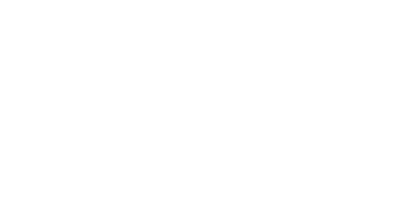

<div align="center">
  
</div>

## New Mac setup

Clone this repository to `~/dotfiles`, then run:

```sh
./scripts/setup.sh
```

The script installs the Homebrew bundle, Node 24, pi, Zap, and links the managed Vim, Zsh, Git, Ghostty, Herdr, Hunk, Zed, and pi configuration. Existing files at managed locations are backed up before being replaced.

Zed installs the Aura theme and Charmed Icons extensions automatically and uses its bundled Zed Mono font. Machine-specific shell secrets belong in `zsh/secrets.zsh`, which is intentionally ignored by Git.
